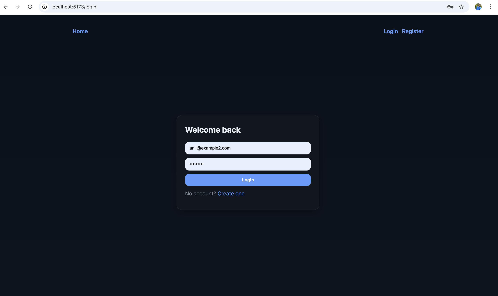
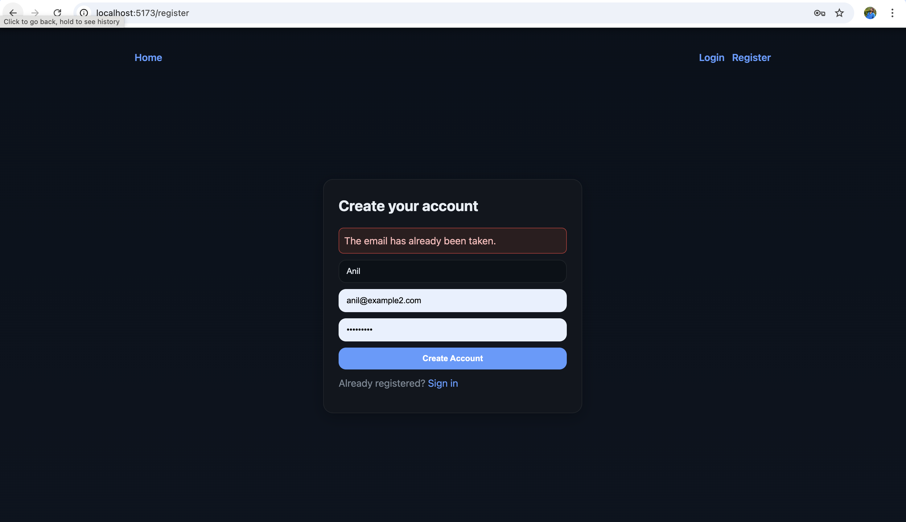
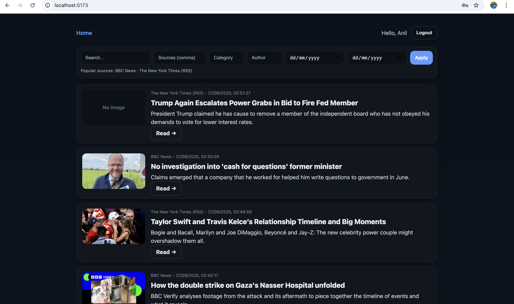
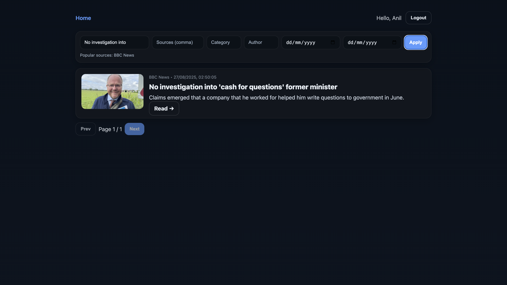

# News Aggregator (Laravel + React + TypeScript + Docker)

A simple full-stack news aggregator that fetches from multiple sources, stores locally, and serves a searchable feed.

> **Tech**: Laravel (Sanctum, Scheduler), MySQL 8, React + Vite + TS, Nginx (for prod UI), Docker Compose.
* Login Screen



* Registration Screen



* Fetched News (Home) Screen



Filtered News (Home) Screen


---

## 1) Prerequisites

* Docker & Docker Compose
* (Optional for local dev): Node 20+, npm, PHP 8.3+, Composer

---

## 2) Quick Start (Docker – recommended)

### 2.1 Clone & env

```bash
git clone https://github.com/aksuhana/NEWS_AGGREGATOR news_aggregator
cd news_aggregator

# Backend env
cp backend/.env.example backend/.env
# Ensure DB points to the docker service:
# DB_CONNECTION=mysql
# DB_HOST=db
# DB_PORT=3306
# DB_DATABASE=news
# DB_USERNAME=news
# DB_PASSWORD=news

# (Optional) Add provider keys later in backend/.env
# NEWSAPI_KEY=...
# GUARDIAN_KEY=...
```

### 2.2 Build & run containers

```bash
docker compose up -d --build
```

Services (default ports):

* **web** (Nginx + built React app): [http://localhost:5173](http://localhost:5173)
* **api** (Laravel): [http://localhost:8000](http://localhost:8000)
* **db** (MySQL 8): host port **3307** → container 3306

> If 3307 is busy, change it in `docker-compose.yml` (`ports: ["3307:3306"]`).

### 2.3 Migrate DB

```bash
docker compose exec api php artisan migrate
```

### 2.4 Load articles (one-off)

Either add API keys (best results) or use RSS fallbacks.

```bash
# Run fetch command now
docker compose exec api php artisan news:fetch
```

### 2.5 Create an account & login

Use the UI:

* Open [http://localhost:5173](http://localhost:5173)
* Register
* Log in and explore the feed

> If you get **401** anywhere, the UI auto-logs out; just log in again.

---

## 3) Dev Workflow (fastest live editing)

### Option A — Vite dev server (no Docker for frontend)

```bash
# Keep Docker running for db+api: `docker compose up -d`
cd frontend
npm ci
npm run dev  # default http://localhost:5173
```

* Make sure `frontend/.env.development` has:

  ```
  VITE_API_BASE=http://localhost:8000/api
  ```

### Option B — Dockerized prod UI (Nginx)

If you’re serving the UI from Docker (`web` service on port 5173), **rebuild** after UI changes:

```bash
docker compose build --no-cache web
docker compose up -d web
```

Then hard refresh your browser (⌘/Ctrl + Shift + R).

---

## 4) Scheduled fetching (cron)

The app ships with a Laravel command `news:fetch` and a scheduler service.

### 4.1 Enable scheduler (runs hourly)

* In `backend/app/Console/Kernel.php`:

  ```php
  protected function schedule(Schedule $schedule): void
  {
      $schedule->command('news:fetch')->hourly();
  }
  ```
* Bring up the scheduler:

  ```bash
  docker compose up -d --build scheduler
  docker compose logs -f scheduler
  ```

### 4.2 Run once manually (anytime)

```bash
docker compose exec api php artisan news:fetch
```

---

## 5) Environment Notes

### Backend (`backend/.env`)

```env
APP_ENV=local
APP_DEBUG=true
APP_URL=http://localhost:8000

DB_CONNECTION=mysql
DB_HOST=db
DB_PORT=3306
DB_DATABASE=news
DB_USERNAME=news
DB_PASSWORD=news

# Optional (improves article coverage/quality)
NEWSAPI_KEY=
GUARDIAN_KEY=
```

> If you change `.env`, clear caches:

```bash
docker compose exec api php artisan optimize:clear
```

### Frontend

* **Prod build (Docker web)**: `VITE_API_BASE=/api` is baked via Docker ARG.
* **Dev server**: set `VITE_API_BASE=http://localhost:8000/api` in `.env.development`.

---

## 6) API (quick reference)

All API routes are under `/api` and require a Bearer token after login.

* `POST /api/register` → `{ name, email, password }`
* `POST /api/login` → `{ email, password }` → returns `{ token, user }`
* `POST /api/logout`
* `GET /api/articles` → query params: `q, sources, category, author, dateFrom, dateTo, page`
* `GET /api/articles/{id}`
* `GET /api/me/preferences` (auth)
* `POST /api/me/preferences` (auth) → `{ sources?: string[], categories?: string[], authors?: string[] }`

---

## 7) Troubleshooting

* **“getaddrinfo for db failed / 2002”**: DB not ready or wrong host.

  * Ensure `DB_HOST=db` in `backend/.env`.
  * `docker compose ps` shows `db` UP & healthy.
  * Restart stack: `docker compose down -v && docker compose up -d --build`.

* **“No scheduled commands are ready to run”**:

  * Normal if using `hourly()`. For testing, temporarily set `everyMinute()` and:

    ```bash
    docker compose exec api php artisan optimize:clear
    docker compose exec api php artisan schedule:run
    ```

* **Frontend changes not visible**:

  * If using Dockerized Nginx web: `docker compose build --no-cache web && docker compose up -d web`, then hard refresh.
  * Prefer `npm run dev` for fast iteration.

* **CORS issues in dev**:

  * Set `backend/config/cors.php`:

    ```php
    'paths' => ['api/*', 'sanctum/csrf-cookie'],
    'allowed_methods' => ['*'],
    'allowed_origins' => ['http://localhost:5173'],
    'allowed_headers' => ['*'],
    ```
  * Clear caches: `php artisan optimize:clear`.

* **Long URLs “Data too long”**:

  * Ensure `articles.url` & `image_url` are `LONGTEXT` and de-dup on `external_id` (migration included).

---

## 8) Project Structure

```
news_aggregator/
  backend/            # Laravel API
  frontend/           # React + Vite + TS
  docker-compose.yml
  README.md
  docs/
    screenshot.png    # put your screenshot here (see below)
```

---

## 9) Adding screenshots to the README

1. Create a folder: `docs/`
2. Save your image as: `docs/screenshot.png`
3. The README already references it:

   ```md
   
   ```
4. For multiple images, add more with clear captions.

---

## 10) Useful Commands

```bash
# Build & start everything
docker compose up -d --build

# Watch container status
docker compose ps

# Logs (service)
docker compose logs -f api
docker compose logs -f web
docker compose logs -f scheduler
docker compose logs -f db

# Run migrations
docker compose exec api php artisan migrate

# Seed/fetch articles now
docker compose exec api php artisan news:fetch

# Clear Laravel caches after env/config changes
docker compose exec api php artisan optimize:clear

# Stop and remove containers + volumes (reset DB)
docker compose down -v
```

---

## 11) Data Sources

* **No-key RSS**: NYT, BBC (images via `media:*`).
* **API (recommended)**: NewsAPI, The Guardian (add keys in `.env`).

---

